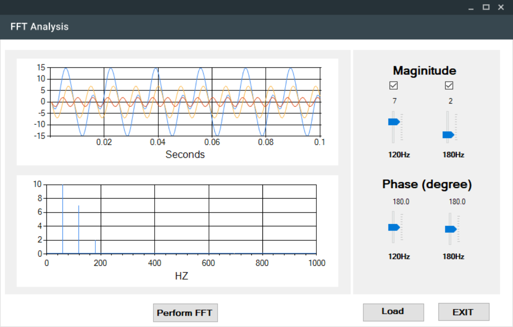

# FFTAnalysis
a simple fast fourier transform analysis tool to demonstrate the fundamental concept of FFT 

<table  border = "1">
  <tr> <th> Screenshot </th> <th> Description </th> </tr>
  <tr> <td align ="center">  </td> <td align ="center"> <b> FFT Analysis Tool Demo </b>  </td> </tr>
</table>

<h2> MathNet.Numerics (Nuget Package) </h2> 
The project uses the MathNet.Numeric package to perform FFT Analysis. 
The more detailed information on the package can be found here : https://numerics.mathdotnet.com/

<h2> MaterialSkin (Nuget Package) </h2> 
In this project, the conventional Winform design has been replaced with a visually appealing skin.  
Please refer to the following link for more detailed information: https://github.com/IgnaceMaes/MaterialSkin

